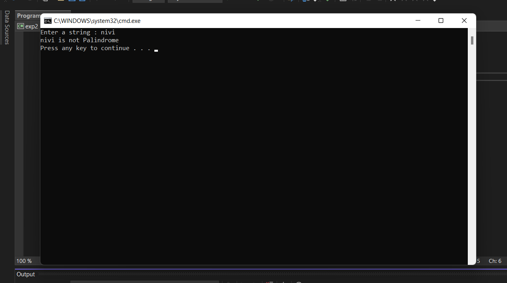

# Palindrome

## Aim:
To write a C# program to find whether the given string is a Palindrome or not.
## Algorithm:
~~~
Step1: Start the Program.

Step2: Create a class and declare two variable with string datatype

Step3: Loop over the entire string and reverse it

Step4: Use if condition to check whether the string and the reversed string is equal or not.

Step5: Print palindrome if it's equal else print not a palindrome.

Step6: Stop the Program.
~~~
## Program:
~~~
using System;
namespace palindrome
{
    public class Program
    {
        static void Main(string[] args)
        {
            string str1;
            string rev = "";
            Console.Write("Enter a string : ");
            str1 = Convert.ToString(Console.ReadLine());

            for (int i = str1.Length - 1; i >= 0; i--)
            {
                rev += str1[i];
            }

            if (str1 == rev)
            {
                Console.WriteLine("{0} is Palindrome.", str1);
            }
            else
            {
                Console.WriteLine("{0} is not Palindrome", str1);
            }
        }
    }
}
~~~

## Output:

## Result:
Thus the C# program to display whether the given string is Palindrome or not is executed successfully.
